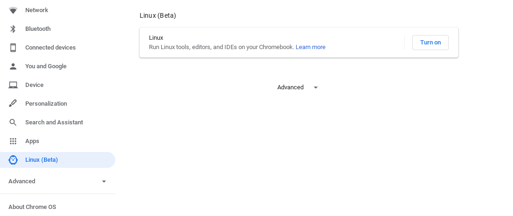
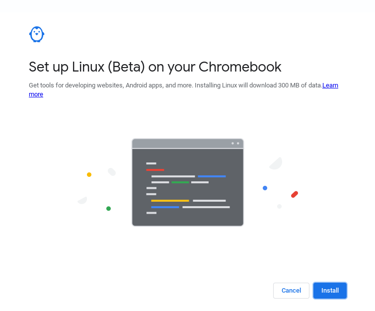
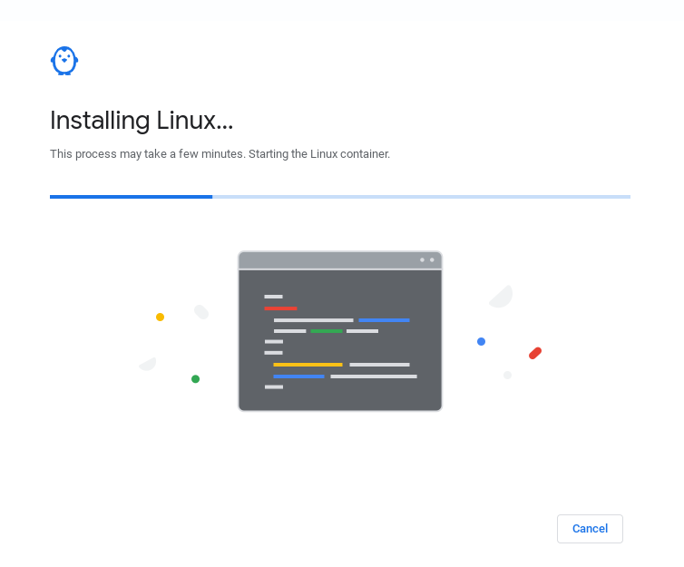
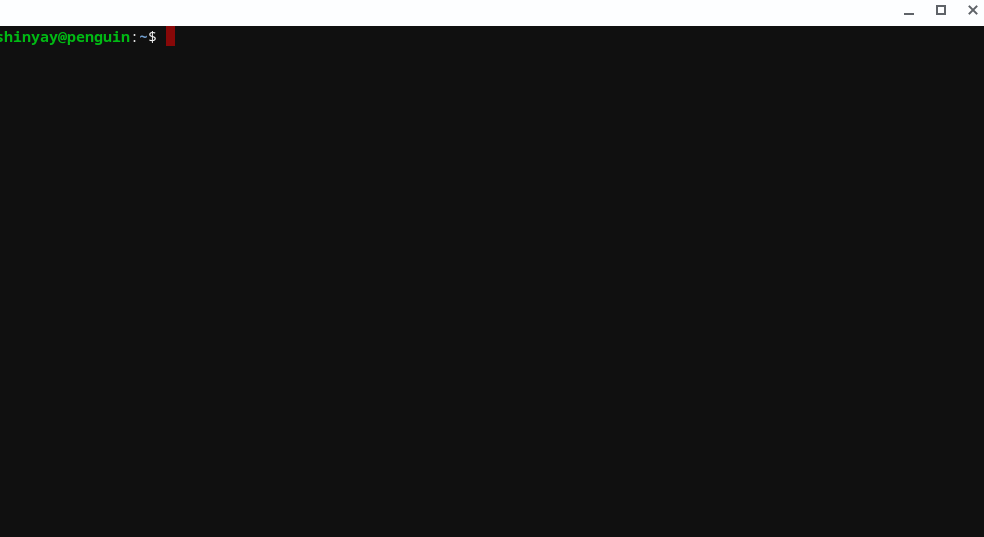

# Chromebooks
---
# Linux Turn on






# Crostini
## 1. Initial Setup
### Update
```
$ sudo apt update && sudo apt upgrade -y
```

### Chrome Configuration
#### GPU Support for Crostini
[Crostini GPU Support](chrome://flags/#crostini-gpu-support)

#### Hyper-Threading
[Scheduler Configuration](chrome://flags#scheduler-configuration)

### Git Configuration
```
$ git config --global user.name "shinyay"
$ git config --global user.email ""
$ git config --global core.quotepath false
$ git config --global core.safecrlf true
$ git config --global core.autocrlf false
$ git config --global core.editor 'vim -c "set fenc=utf-8"'
$ git config --global color.diff auto
$ git config --global color.status auto
$ git config --global color.branch auto
```

#### Git Alias
- **git status**
```
$ git config --global alias.st status
````

- **git log**
```
$ git config --global alias.plog "log --pretty='format:%C(yellow)%h %C(green)%cd %C(reset)%s %C(red)%d %C(cyan)[%an]' --date=iso"
$ git config --global alias.glog "log --pretty='format:%C(yellow)%h %C(green)%cd %C(reset)%s %C(red)%d %C(cyan)[%an]' --date=format:'%c' --all --graph"
```

### Japanese Env
#### Timezone
```
$ sudo dpkg-reconfigure tzdata
```

#### Font
```
$ sudo apt -y install task-japanese locales-all fonts-ipafont
```

- **Cica**
```
$ wget https://github.com/miiton/Cica/releases/download/v5.0.1/Cica_v5.0.1_with_emoji.zip
$ unzip Cica_v5.0.1_with_emoji.zip 
$ mkdir .fonts
$ mv Cica-* .fonts/
$ sudo fc-cache -fv
$ rm -fr Cica_v5.0.1_with_emoji.zip COPYRIGHT.txt LICENSE.txt
```

#### Locale
```
$ sudo localectl set-locale LANG=ja_JP.UTF-8 LANGUAGE="ja_JP:ja"
```
```
$ source /etc/default/locale
```

## 2. IntelliJ
### SDKMAN!
```
$ curl -s "https://get.sdkman.io" | bash
$ source  "$HOME/.sdkman/bin/sdkman-init.sh"
$ sdk help
```
```
$ vim ~/.sdkman/etc/config
sdkman_beta_channel=true

$ sdk selfupdate force
```
### JDK
```
$ sdk list java
$ sdk install java 11.0.7-open
```

### IntelliJ
Open [IntellJ for Linux Download](https://www.jetbrains.com/idea/download/#section=linux)

```
$ sudo tar xvf ideaIU-2020.1.tar.gz -C /opt
```

## 3. Fish
```
$ sudo apt install fish
$ sudo chsh --shell $(which fish) $USER
```

### Change to Bash
```
$ sudo chsh --shell (which bash) $USER
```

### Completion
- **git**

```
$ curl https://raw.githubusercontent.com/fish-shell/fish-shell/master/share/completions/git.fish > ~/.config/fish/completions/git.fish
```

### Fisherman
```
$ curl https://git.io/fisher --create-dirs -sLo ~/.config/fish/functions/fisher.fish

fisher version 3.2.10 ~/.config/fish/functions/fisher.fish
```

### Fish Plugin
- **peco**

By pushing ctrl + r, you can search shell history
```
$ sudo https://github.com/peco/peco/releases/download/v0.5.7/peco_linux_amd64.tar.gz
$ sudo tar xzvf peco_linux_amd64.tar.gz
$ sudo chmod +x peco_linux_amd64/peco 
$ sudo mv peco_linux_amd64/peco /usr/local/bin
$ sudo rm -fr peco_linux_amd64 peco_linux_amd64.tar.gz
$ fisher add oh-my-fish/plugin-peco
$ vim ~/.config/fish/config.fish

# fisher add oh-my-fish/plugin-peco
function fish_user_key_bindings
  bind \cr peco_select_history
end
```

- **bobthefish**

[oh-my-fish/theme-bobthefish](https://github.com/oh-my-fish/theme-bobthefish)
```
$ fisher add oh-my-fish/theme-bobthefish

$ git clone https://github.com/powerline/fonts.git
$ ./fonts/install.sh
$ rm -rf ./fonts
```

```
$ vim ~/.config/fish/config.fish

set -g theme_display_git_master_branch yes
set -g theme_display_git yes
set -g theme_display_git_dirty yes
set -g theme_display_git_untracked yes
set -g theme_display_git_ahead_verbose yes
set -g theme_display_git_dirty_verbose yes
set -g theme_display_git_stashed_verbose yes
set -g theme_git_worktree_support no
set -g theme_use_abbreviated_branch_name no

set -g theme_display_vagrant no
set -g theme_display_docker_machine no
set -g theme_display_k8s_context yes
set -g theme_display_hg no
set -g theme_display_virtualenv no
set -g theme_display_nix no
set -g theme_display_ruby no
set -g theme_display_nvm no
set -g theme_display_user ssh
set -g theme_display_hostname ssh
set -g theme_display_vi no
set -g theme_display_date yes
set -g theme_display_cmd_duration yes

set -g theme_title_display_process no
set -g theme_title_display_path yes
set -g theme_title_display_user no
set -g theme_title_use_abbreviated_path no

set -g theme_date_format "+%F %H:%M"
set -g theme_date_timezone Asia/Tokyo
set -g theme_avoid_ambiguous_glyphs yes
set -g theme_powerline_fonts yes
set -g theme_nerd_fonts no
set -g theme_show_exit_status yes
set -g theme_display_jobs_verbose yes
set -g default_user your_normal_user
set -g theme_color_scheme loght
set -g fish_prompt_pwd_dir_length 0
set -g theme_project_dir_length 1
set -g theme_newline_cursor yes
set -g theme_newline_prompt '$ '
```

- **z**

By z, it tracks the directory you have visited
```
$ fisher add jethrokuan/z
```

- **fish-bd**

By bd, you can quickly go back to a parent directory in your current working directory tree
```
$ fisher add 0rax/fish-bd
```

- **sdkman-for-fish**
```
$ fisher add reitzig/sdkman-for-fish
```

## Google Cloud SDK
